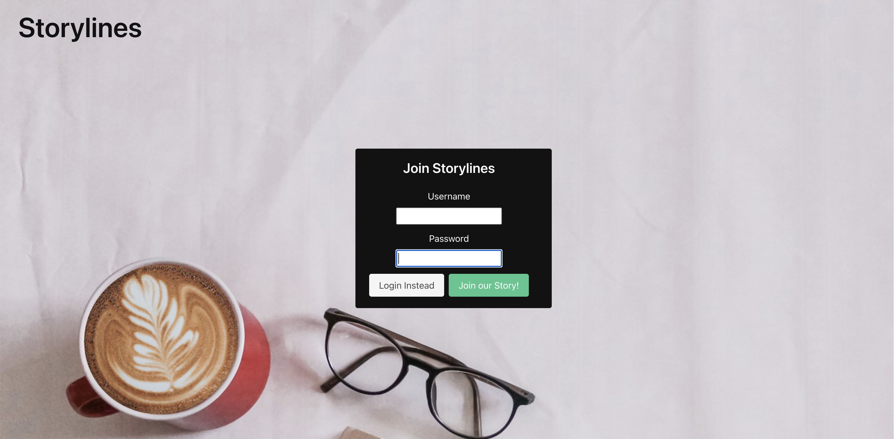
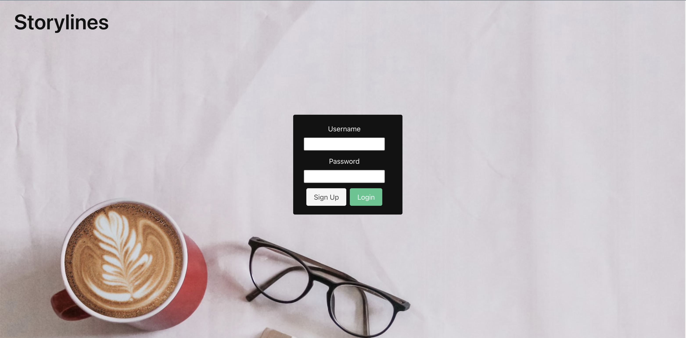
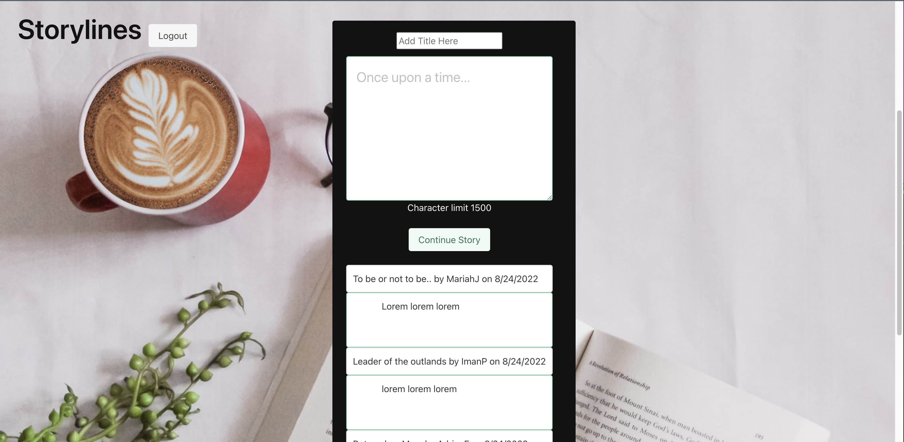

# Storylines

## Description

Storylines is a website that allows you to explore your writing creativity. Once you sign up for an account, you can create new stories to share with other collaborators. With this application, you can submit a few paragraphs of a story that you want to start and other collaborators can continue to add onto your story. In the end, the story can and will take many twists and turns that are completely unexpected. You can create as many stories as you would like, as well as contribute to other collaborators stories as well. Sign up and let your imagination run wild!

## Table of Contents (Optional)

- [Installation](#installation)
- [Usage](#usage)
- [Credits](#credits)
- [License](#license)

## Installation
Step 1: Install all necessary libraries. 
 
-To install you will need to open a new terminal and type in npm i **insert name of libraries here** and press enter.  
-Those libraries include: brcrypt, connect-session-sequelize, dotenv, express, express-handlebars, express-session, mysql2 and sequelize.
 
 
Step 2: Open a new terminal and sign in to mysql.
 
 
Step 3: In the terminal, you will need to run the schema file by typing source db/schema.sql; and press enter.
 
 
Step 4: Go into a new terminal and type npm run seeds.
 
 
Step 5: Type npm start
 
 
Step 6: Go into your web browser and type in the url: localhost:3001
 
 
Step 7: Sign up for Storylines by creating a unique username and password.
 
 
Step 8: Explore your creativity by writing your own stories and sharing them with other collaborators!

## Usage

 <a href="https://project2-em.herokuapp.com/">Click for live link</a>

## Credits

Emily: Project manager, public js and presentation.
 
GitHub: emmcewen
 
 
Iman: Models
 
GitHub: y2kRULEZ
 
 
Adrian: Routes
 
GitHub: afirmalan
 
 
Marilyn: CSS
 
GitHub: 0magical
 
 
Mariah: Handlebars/HTML, assisted with some CSS and ReadMe.
 
GitHub: Mariah217

## License
MIT License

Copyright (c) [2022] [Emily McEwen, Iman Pace, Adrian Firmalan, Marilyn Ventura, Mariah Johnston ]

Permission is hereby granted, free of charge, to any person obtaining a copy
of this software and associated documentation files (the "Software"), to deal
in the Software without restriction, including without limitation the rights
to use, copy, modify, merge, publish, distribute, sublicense, and/or sell
copies of the Software, and to permit persons to whom the Software is
furnished to do so, subject to the following conditions:

The above copyright notice and this permission notice shall be included in all
copies or substantial portions of the Software.

THE SOFTWARE IS PROVIDED "AS IS", WITHOUT WARRANTY OF ANY KIND, EXPRESS OR
IMPLIED, INCLUDING BUT NOT LIMITED TO THE WARRANTIES OF MERCHANTABILITY,
FITNESS FOR A PARTICULAR PURPOSE AND NONINFRINGEMENT. IN NO EVENT SHALL THE
AUTHORS OR COPYRIGHT HOLDERS BE LIABLE FOR ANY CLAIM, DAMAGES OR OTHER
LIABILITY, WHETHER IN AN ACTION OF CONTRACT, TORT OR OTHERWISE, ARISING FROM,
OUT OF OR IN CONNECTION WITH THE SOFTWARE OR THE USE OR OTHER DEALINGS IN THE

SOFTWARE.

## Badges

 
 
 

